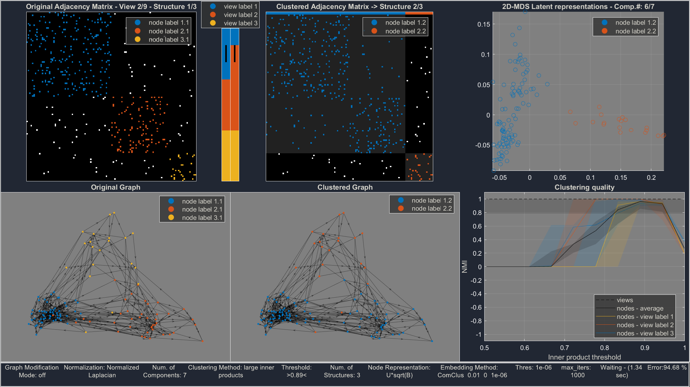

# Multi-Graph Explorer

## Overview

**Multi-Graph Explorer** is a comprehensive framework designed for advanced multi-graph analysis and method development. This tool aims to facilitate the exploration and visualization of multi-graph data, providing a versatile platform for researchers and developers.

**Full Title**: Multi-Graph Explorer: A Framework for Advanced Multi-graph Analysis and Method Development

## Features

- **Advanced Analysis**: Perform in-depth analysis on multi-graph data.
- **Method Development**: Develop and integrate new methods for multi-graph analysis.
- **Visualization**: Create detailed visual representations of multi-graph structures.

- run single_run_GUI.m and param_sweep_explore_demo.m to reproduce the results of the paper
- For overview of the key bindings in single_run_GUI.m run "help single_run_GUI.m"

## Dependencies

- [MATLAB](https://www.mathworks.com/products/matlab.html) - **Required** (Tested on MATLAB 2019b)
- [MATLAB Image Processing Toolbox](https://www.mathworks.com/products/image-processing.html) - **Required**
- [scikit-learn](https://scikit-learn.org/stable/) - **Required** (Tested with Python 3.6 and scikit-learn 0.24.2)
- [MATLAB Statistics and Machine Learning Toolbox](https://www.mathworks.com/products/statistics.html) - **Optional**
- [MATLAB Parallel Computing Toolbox](https://www.mathworks.com/products/parallel-computing.html) - **Optional**
- [MTIMESX](https://www.mathworks.com/matlabcentral/fileexchange/25977-mtimesx-fast-matrix-multiply-with-multi-dimensional-support) - **Optional**

## License

This project is licensed under the MIT License - see the [LICENSE](LICENSE) file for details.

## Contact

For questions or comments, please contact Yorgos Tsitsikas at [gtsitsik@gmail.com](mailto:gtsitsik@gmail.com).
