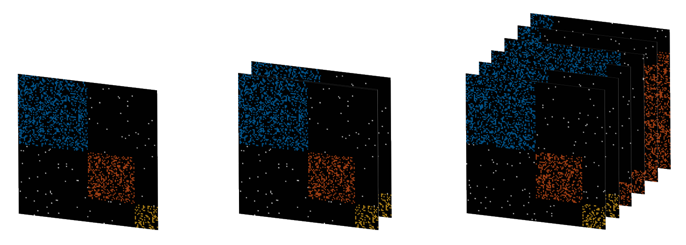

[](https://opensource.org/licenses/Apache-2.0)
<div align="center">


# Multi-Graph Explorer

### A Framework for Advanced Multi-Graph Analysis and Method Development



</div>


## Overview
Multi-Graph Explorer is a MATLAB software that aims to enable researchers to
streamline all stages of multi-graph method development, while also providing
practitioners with a unified toolkit for efficiently discovering structure in
real-world multi-graphs.


This project is associated with the following demo paper:

|Yorgos Tsitsikas and Evangelos E. Papalexakis. Multi-graph explorer: A framework for advanced multi-graph analysis and method development. In _Proceedings of the 33nd ACM International Conference on Information and Knowledge Management_, October 2024|
| :--- |

Also, the peer-reviewed version of the manuscript can be found here: https://www.cs.ucr.edu/~epapalex/papers/24-CIKM-Multi-Graph-Explorer.pdf

BibTeX users can cite this work as follows:
```bibtex
@inproceedings{multi-graph-explorer,
  title={Multi-Graph Explorer: A framework for Advanced Multi-Graph Analysis and Method Development},
  author={Tsitsikas, Yorgos and Papalexakis, Evangelos E.},
  booktitle={Proceedings of the 33rd ACM International Conference on Information and Knowledge Management},
  year={2024},
  month={October},
  doi={10.1145/3627673.3679213},
  isbn={979-8-4007-0436-9/24/10}
}
```


### Features

- **Artificial multi-graph generator**: Generate artificial multi-graphs in a succinct yet flexible and
  comprehensive manner.
- **Efficient non-standard parameter sweeps**:  Define value ranges for
  arbitrary combinations of all parameters and their subparameters for a thorough
  and systematic study of the multi-graph analysis workflow. 
- **Interactive graphical user interface**: Adjust the parameters of the
  experiments and explore their results efficiently and intuitively.
- **High-quality method implementations**: Experiment with optimized
  implementations of existing multi-graph methods.
- **Customization and Extensibility**: Multi-Graph Explorer aims to maximize
  the ability of the users to customize the environment and to augment it with
  additional functionality.

https://github.com/user-attachments/assets/60a2409e-daf6-474a-97f7-f44a0e7fdd2a

## Dependencies

- [MATLAB](https://www.mathworks.com/products/matlab.html) - **Required** (Tested on MATLAB 2019b)
- [MATLAB Statistics and Machine Learning Toolbox](https://www.mathworks.com/products/statistics.html) - **Required**
- [MATLAB Image Processing Toolbox](https://www.mathworks.com/products/image-processing.html) - **Required**
- [scikit-learn](https://scikit-learn.org/stable/) - **Required** (Tested with Python 3.6 and scikit-learn 0.24.2)
- [MATLAB Parallel Computing Toolbox](https://www.mathworks.com/products/parallel-computing.html) - **Optional**
- [MTIMESX](https://www.mathworks.com/matlabcentral/fileexchange/25977-mtimesx-fast-matrix-multiply-with-multi-dimensional-support) - **Optional**

## Installation
- Make sure the current directory within MATLAB is the project's root directory at all times.
- For instructions on how to configure MATLAB to use Python see [here](https://www.mathworks.com/help/matlab/matlab_external/install-supported-python-implementation.html).

## Usage
- Run `single_run_GUI.m` to launch the Single-Combination Parameter Explorer.
- Run `param_sweep_explore_demo.m` to see an example of using the Multi-Combination Parameter Explorer.
- For further documentation, use MATLAB's `help` function (e.g. `help single_run_GUI.m`).  

## License
[Apache License, Version 2.0](./LICENSE)
